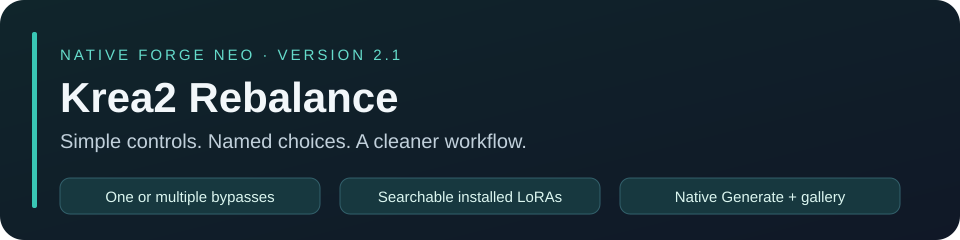
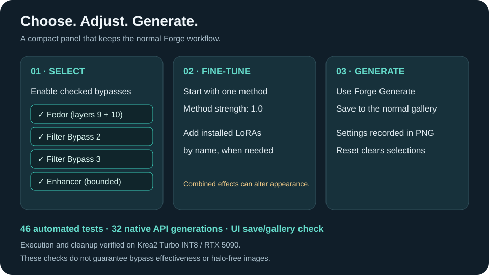

# Krea2 Rebalance 2.0.1

Prompt controls for native Krea 2 in Forge. Restart Forge after updating.

## Start here

After updating, restart Forge and click **Reset**, then enable the panel and begin with Balanced. Use Prompt strength to adjust the rebalance. The optional Avoid field accepts plain concepts such as `stripes, lettering, red background`. It is an experimental selective negative-attention path, not a guarantee that a concept disappears.

Avoid requires native Forge Krea 2, CFG 1 (including the hires pass), and no image/reference conditioning or conflicting model/attention hooks. Unsupported combinations produce a visible warning and metadata status; rebalance remains available. Avoid supports up to 128 tokens. It does not parse weighting syntax or prompt schedules. Leave it empty to disable it.

## October 4, 2026: correction-limit fix

Balanced and Reset previously restored a correction limit of 1.0, overriding the safer 0.25 default. Strong restored 1.3. This allowed aggressive text-conditioning changes and could produce harsh contrast or washed-out detail even when the panel appeared balanced.

Gentle now uses 0.15, Balanced and Reset use 0.25, and Strong uses 0.35. The runtime caps correction at 0.50, including old saved settings; metadata records the requested and effective values. The summary and slider now agree.

For a clean comparison, keep the same seed, prompt, checkpoint, LoRAs, steps, and sampler. Compare Rebalance off with Balanced at 0.25. If the appearance is still wrong, test the optional LoRA separately and reduce the character LoRA strength. At CFG 1, ordinary negative prompts are ignored by Forge; the optional Avoid field is a separate experimental feature.

The October 4 saved images confirmed cap 1.0 was in use. Different seeds prevent those images from proving that this setting caused every appearance issue. Automated tests check the correction limits and controls; corrected real-model images still need visual verification.

## Changes

- Reference and candidate text-fusion passes use independent input storage; zero correction skips unnecessary passes.
- Rebalance and legacy V-Flip share one final correction budget and energy limit; invalid candidate tokens fall back to reference tokens.
- Selective Avoid negates only the avoided concept span's attention values; all temporary hooks are removed after each model call.
- Optional LoRA loading uses Forge's model patcher directly and reports how many patches registered; prompt-managed LoRAs take priority.
- Ambiguous or unsupported adapter files are rejected across configured LoRA directories.
- Optional single-entry text-fusion cache is scoped to the sampling pass and bypasses custom hooks and unknown attention options.
- Metadata records version, settings, adapter status, Avoid status, fusion-pass count, cache hits, and recovered candidate-token count.

## Simple controls

Gentle, Balanced, and Strong change rebalance settings only. Reset restores the panel's defaults, empties Avoid, and disables caching and legacy V-Flip. Advanced retains the existing power modes and legacy layer weights for compatibility.

## Validation and limits

The included `tests/test_krea2.py` runs focused tests using Torch fixtures and the installed Gradio. Tests cover input ownership, correction bounds, cache invalidation, hook restoration, batch expansion, encoder token boundaries, LoRA registration status, sampling cleanup, and UI callbacks. `tests/gpu_check.py` checks FP16/BF16 tensor behavior on CUDA. These are not real-checkpoint image-quality benchmarks.

Real Krea 2 generation quality, selective-suppression effectiveness, adapter efficacy, and full-model speedups still require paired-seed image tests. Caching and Avoid are experimental. NAG and adaptive schedules are not implemented in this version.

## References

Selective attention-value negation is informed by the NegPiP approach; this extension uses its own scoped implementation and does not install or enable another extension.

- [Original NegPiP and Krea 2 support](https://github.com/hako-mikan/sd-webui-negpip)
- [Krea 2 official inference code](https://github.com/krea-ai/krea-2)

## Recovery

The updater creates a timestamped backup in the extension folder. Restore its script and README, then restart Forge, to return to the previous version. Version 2.0 intentionally fixes the numerical path, so old seeds/settings may generate different images.

## Optional Qwen moiré cleanup

The **Qwen moiré cleanup** accordion adds a final-image filter for noise patterning or moiré. It works independently of the Krea 2 controls and is disabled by default. Enable **Reduce output moiré**, then adjust **Cleanup strength** from 0 to 1; the default 0.35 blends a milder correction, while 1 applies the source kernel exactly.

The filter uses the referenced seven-tap kernel `[-1, 6, -15, 20, -15, 6, -1] / 64` with edge-clamped sampling and the source operation `I - Bx - By + Bxy`. RGB and RGBA outputs are supported; RGBA alpha and image metadata are preserved. Other modes are left unchanged.

Source: [Qwen Image 2.1 noise-patterning/moiré mild workaround](https://www.reddit.com/r/StableDiffusion/comments/1wlv3tf/qwen_image_21_noisepatterningmoire_mild_workaround/) and its [original Pastebin shader](https://pastebin.com/v7y1z0SH).

## Special Thanks

Special thanks to:

- [r/sdforall](https://www.reddit.com/r/sdforall/) — community discussion and testing
- [r/SECourses](https://www.reddit.com/r/SECourses/) — community discussion and testing
- [r/malcolmrey](https://www.reddit.com/r/malcolmrey/) — community discussion and testing
- [**Haoming02 / sd-webui-forge-classic (neo branch)**](https://github.com/Haoming02/sd-webui-forge-classic/tree/neo) — the Forge Neo tree this extension targets
- [**ComfyUI**](https://github.com/comfyanonymous/ComfyUI) — reference for upstream sampler/scheduler coverage
- The Forge / AUTOMATIC1111 community — for the extension ecosystem this plugs into
- Project Invisible extensions — memory policy, GPU compatibility and extension philosophy

Thank you to the wider Forge, Diffusers, Qwen, DeGrid and open-source communities.
